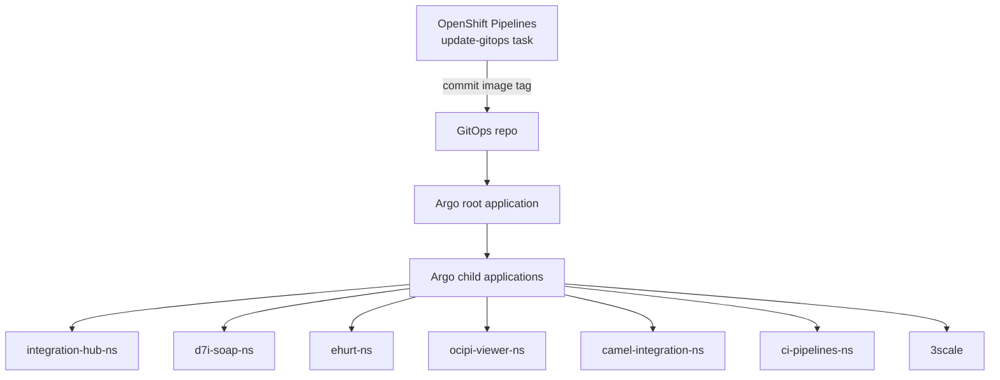
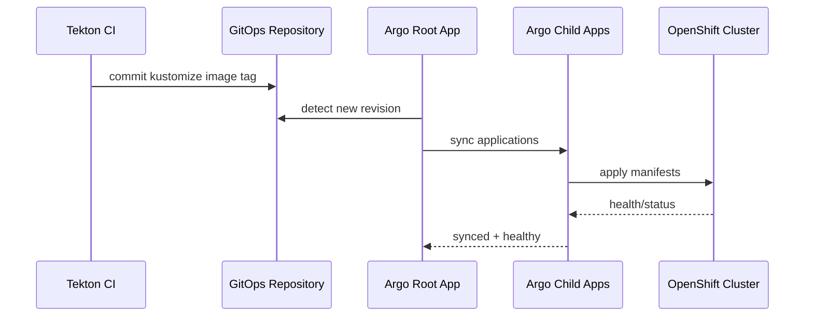

# integration-hub-service-gitops

GitOps source-of-truth repository for Integration Hub platform and workloads.

This repository is consumed by OpenShift GitOps (Argo CD).
Pipeline task `update-gitops` commits image tag updates here.

## 1. What belongs here

- `platform/apps/**`: all app deployment manifests and overlays
- `platform/namespaces/**`: project namespaces and Argo role bindings
- `platform/3scale/**`: 3scale product/backend/activedoc/mapping resources
- `platform/gitops/**`: Argo app-of-apps manifests
- `platform/tekton/base/**`: Argo-managed Tekton stack manifests

## 2. What does NOT belong here

- Java source code
- Maven settings with credentials
- local test artifacts
- generated runtime secrets

## 3. Argo CD model

Root application:

- `platform/gitops/root-application.yaml`

Child applications:

- `platform/gitops/apps/namespaces.yaml`
- `platform/gitops/apps/tekton.yaml`
- `platform/gitops/apps/integration-hub.yaml`
- `platform/gitops/apps/d7i-soap.yaml`
- `platform/gitops/apps/ehurt.yaml`
- `platform/gitops/apps/ocipi-viewer.yaml`
- `platform/gitops/apps/camel-integration.yaml`
- `platform/gitops/apps/three-scale.yaml`

## End-to-End Visualization





## 4. Day-1 setup

### 4.1 Apply root app

```bash
oc -n openshift-gitops apply -f platform/gitops/root-application.yaml
```

### 4.2 Verify sync

```bash
oc -n openshift-gitops get applications
oc -n openshift-gitops get application integration-hub-platform-root -o wide
```

## 5. Day-2 operations

### 5.1 See latest GitOps image updates

```bash
git log --oneline -n 20
```

Expected commit style from CI:

- `ci: update apps/integration-hub-service image to <tag>`
- `ci: update demo-systems/d7i-soap-service image to <tag>`
- `ci: update demo-systems/ehurt-service image to <tag>`
- `ci: update demo-systems/ocipi-service image to <tag>`

### 5.2 Manual image pinning (if needed)

Edit these files:

- `platform/apps/integration-hub/overlays/prod/kustomization.yaml`
- `platform/apps/d7i-soap/overlays/prod/kustomization.yaml`
- `platform/apps/ehurt/overlays/prod/kustomization.yaml`
- `platform/apps/ocipi-viewer/overlays/prod/kustomization.yaml`

Then commit and push.

### 5.3 Force Argo refresh

```bash
oc -n openshift-gitops annotate application integration-hub-platform-root argocd.argoproj.io/refresh=hard --overwrite
```

## 6. 3scale specifics

### 6.1 When MappingRule CRD exists

`platform/3scale/base/mapping-rule.yaml` is managed declaratively.

### 6.2 When MappingRule CRD is missing

The 3scale app may become degraded or APIcast route can return `404` / `No Mapping Rule matched`.
In this case, create mapping rules through 3scale Admin API and redeploy APIcast config.

## 7. Tekton task requirements

`platform/tekton/base/tasks/task-update-kustomize-image.yaml` must clone into an isolated dir (`repo-gitops`) so it never reuses app source checkout.

If this regresses, `update-gitops` fails with path errors (`platform/apps/.../kustomization.yaml.tmp: No such file or directory`).

## 8. Validation checklist

After each platform update:

1. `oc -n openshift-gitops get applications` all app entries `Synced`.
2. `oc -n ci-pipelines-ns get pipelineruns` new runs complete.
3. `oc -n integration-hub-ns get pods` and other app namespaces are healthy.
4. 3scale route requests resolve with expected auth + mapping behavior.

## 9. Commit policy

Recommended prefixes:

- `feat(gitops): ...` for new deploy capabilities
- `fix(gitops): ...` for deployment bug fixes
- `chore(gitops): ...` for non-functional cleanup
- `ci: update ... image to ...` reserved for automated pipeline commits
